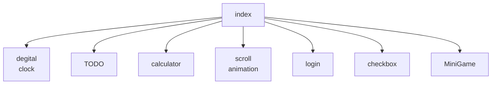

# いろいろお試し中
練習用レポジトリ

index(トップページ)からいろいろな機能にアクセスする

@startuml
skin rose
left to right direction

:アクタ1: as act1
:アクタ2: as act2
rectangle "システム境界" {
	(ユースケース1) as UC1
	(ユースケース2) as UC2
	(ユースケース3) as UC3
}
act1 --> UC1
act1 --> UC2
act1 --> UC3
UC1 <-- act2
UC2 <-- act2
UC3 <-- act2
@enduml
