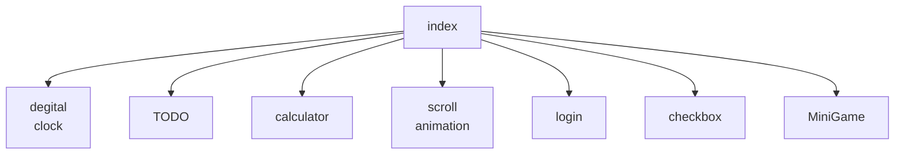

# いろいろお試し中
練習用レポジトリ

index(トップページ)からいろいろな機能にアクセスする

```mermaid
  graph TD;
  A["index"]
  B["degital<br>clock"]
  C["TODO"]
  D["calculator"]
  E["scroll<br>animation"]
  F["login"]
  G["checkbox"]
  H["MiniGame"]
      A-->B & C & D & E & F & G & H;
```
%%{init:{'theme':'dark'}}%%
classDiagram
	direction LR
	class Class~内部で管理する型T~ {
		-std::vector~T~ v
	}
	Class <|.. ClassInt: bind (int)
